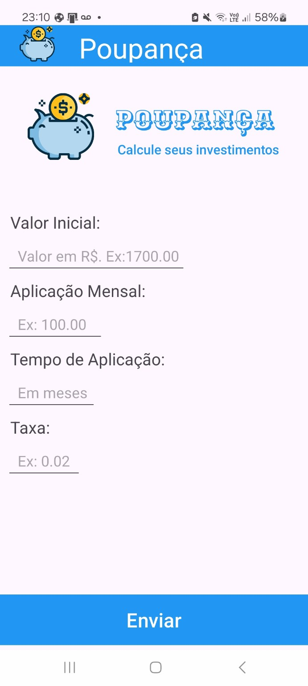

# 💰 Poupança Fácil

Aplicativo desenvolvido em dupla para a disciplina de Desenvolvimento Mobile, utilizando o Android Studio.

O projeto consiste na criação da **interface visual de um aplicativo de simulação de investimentos**, com foco na organização e apresentação dos elementos da tela.

## 📱 Sobre o projeto

O **Poupança Fácil** foi desenvolvido como uma proposta de aplicativo para auxiliar o usuário na simulação de uma aplicação financeira.

Nesta etapa do projeto, foi desenvolvido somente o **layout da aplicação**, conforme solicitado pelo professor. A parte de programação e funcionamento dos cálculos não foi implementada.

## 🎨 Interface

A tela desenvolvida contém:

- 🐷 Logo e identidade visual do aplicativo;
- 💰 Título "Poupança";
- 📊 Área de apresentação "Calcule seus investimentos";
- 💵 Campo para informar o valor inicial;
- 💰 Campo para informar a aplicação mensal;
- 📅 Campo para informar o tempo de aplicação;
- 📈 Campo para informar a taxa;
- 🔵 Botão "Enviar".

### 📸 Tela principal

## 🛠️ Tecnologias utilizadas

- **Android Studio**
- **Java**
- **XML**
- **Android SDK**

> Nesta versão, a lógica de cálculo e o funcionamento dos campos ainda não foram implementados, pois o objetivo desta etapa foi a construção do layout.

## 👥 Desenvolvedores

Projeto desenvolvido em dupla por:

- **[Nome do integrante 1]**
- **[Nome do integrante 2]**

## 📌 Status do projeto

🚧 **Em desenvolvimento**

Atualmente, o projeto possui a implementação visual da tela principal. A funcionalidade de cálculo dos investimentos poderá ser implementada em uma etapa posterior.
